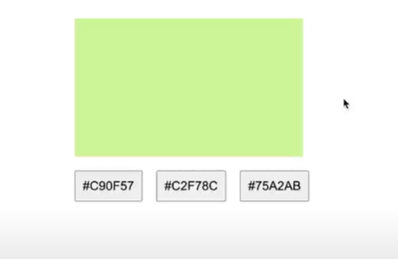

I

# Technical Exercise: Build a Color Guessing Game

## **Requirements:**

**Game Functionality:**

- **Color Display:**
  - Implement a component that displays a randomly generated color in a square box.
- **Hexadecimal Color Choices:**
  - Below the color box, provide three buttons. Each button should display a hexadecimal color code.
  - One of these hexadecimal codes should correspond to the displayed color, while the other two should be randomly generated but different from the correct code.
- **User Interaction:**
  - When the user clicks on one of the buttons:
    - If the selection is correct, display a message indicating success (e.g., "Correct!").
    - If the selection is incorrect, display an error message (e.g., "Wrong. Try Again.").
  - Allow the user to keep guessing until the correct color is selected.

